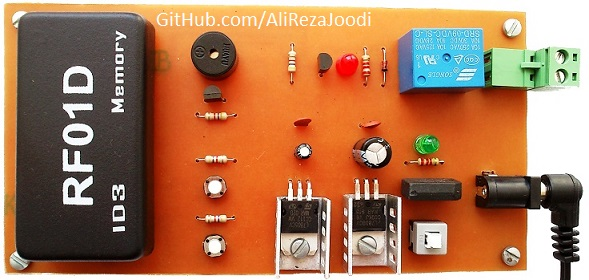

## RFID Code Lock with 125KHz Tag
It made with `RF01D_ID3_Memory` module. Processing tasks do by the module. We add or delete new cards with two keys. It's a very easy project.
I have tested it many times and worked great.

Note: `RF01D_ID3_Memory` module is only available in the Iranian market. I don't know, Is there like the module in other country?

### Folders and Files Description
It has included:
- `Hardware` (Included hardware layers)
- `Pictures` (Included photos samples made)

### Picture: v1.0

### Schematic: v1.0

My GitHub: [GitHub.com/AliRezaJoodi](https://github.com/AliRezaJoodi)  
**Note**: [You can go here to download a single folder or file from GitHub.com](https://minhaskamal.github.io/DownGit/#/home)