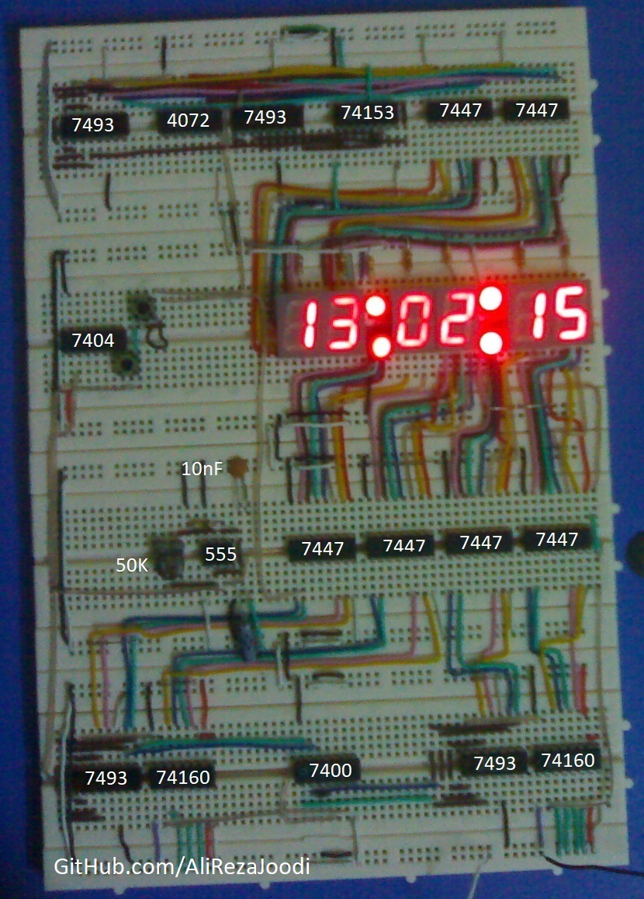
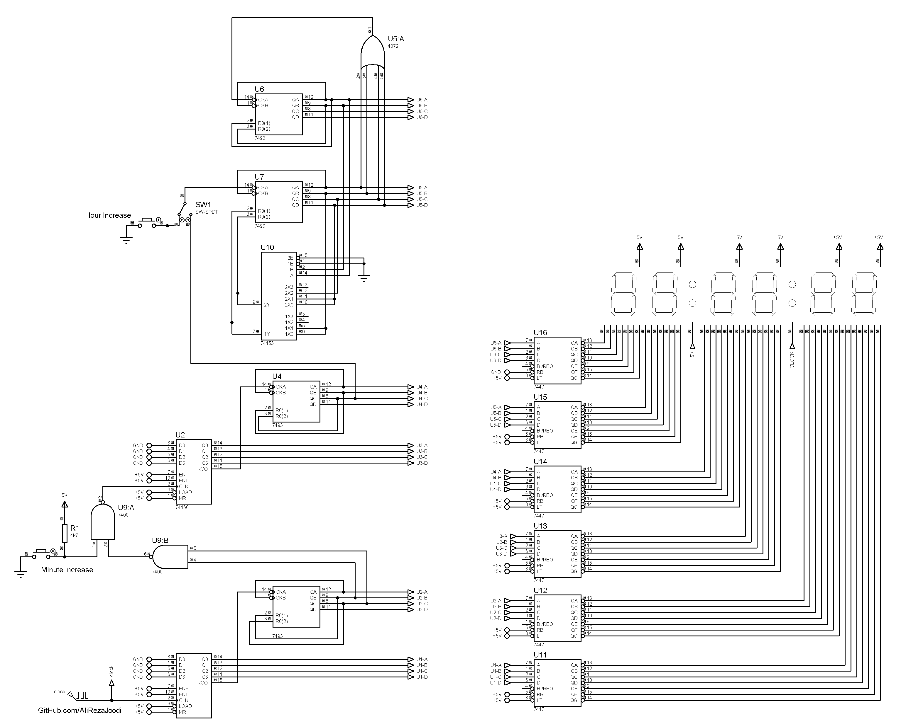

##  Digital Clock Using Logic Gates 
I have tested it and worked great.

### Folders and Files Description
It has included:
- `Pictures` (Included photos samples made)
- `Simulate` (Simulator File)

### Picture: v1.0

### Simulate: v1.0

### Video: v1.0
[Youtube.com/@AliRezaJoodi](https://www.youtube.com/watch?v=DUZTfmVEh0s) 

My GitHub: [GitHub.com/AliRezaJoodi](https://github.com/AliRezaJoodi)  
**Note**: [You can go here to download a single folder or file from GitHub.com](https://minhaskamal.github.io/DownGit/#/home)