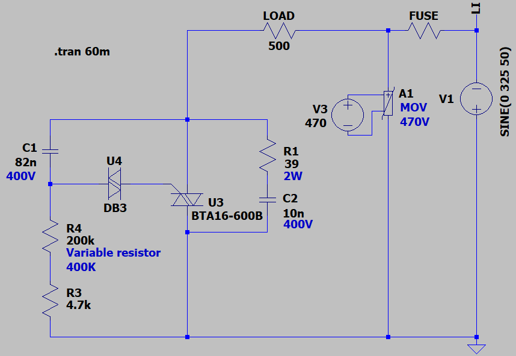

## Single Phase Dimmer
Note: The design is not mine. This project is just an attempt to understand and simulate a commercial product circuit using LTspice. 

### Picture
v1.0, Market sample (Not my product)  

### Simulate
v1.1, Schematic  

v1.1, Plot  

### More Information
**Note**: [You can go here to download a single folder or file from GitHub.com](https://minhaskamal.github.io/DownGit/#/home)  
My GitHub Account: [GitHub.com/AliRezaJoodi](https://github.com/AliRezaJoodi)  