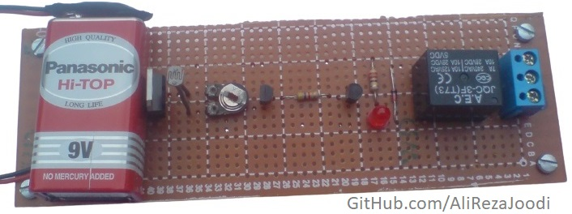
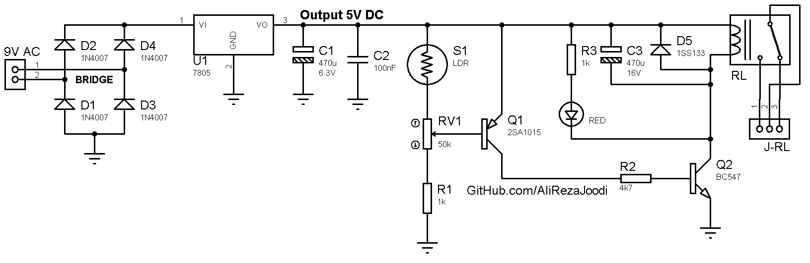

## Night Light
Note: It is initial version and should get better.

### Folders and Files Description
It has included:
- `Hardware` (Included hardware layers)
- `Pictures` (Included photos samples made)

### Picture: v1.0

### Schematic: v1.0

### Video: v1.0
[Youtube.com/@AliRezaJoodi](https://www.youtube.com/watch?v=f5Mxya4S2iQ) 

My GitHub: [GitHub.com/AliRezaJoodi](https://github.com/AliRezaJoodi)  
**Note**: [You can go here to download a single folder or file from GitHub.com](https://minhaskamal.github.io/DownGit/#/home)