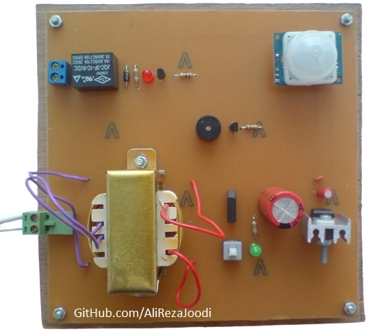
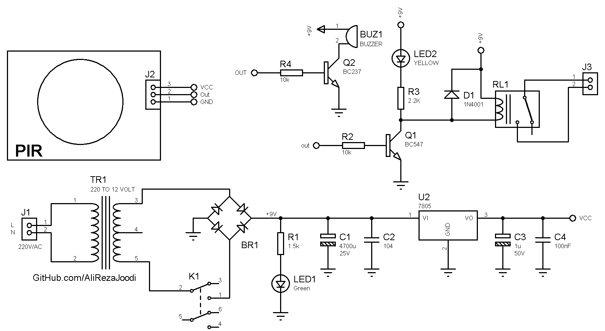

## PIR Alarm
It's made with IR module. Module output is 0 or 1. So, It's using very easy.
I have tested it many times and worked great.

### Folders and Files Description
It has included:
- Hardware (Included hardware layers)
- Pictures (Included photos samples made)
- Simulate (Included simulator file)

### Picture: v1.0

### Schematic: v1.0

My GitHub: [GitHub.com/AliRezaJoodi](https://github.com/AliRezaJoodi)  
**Note**: [You can go here to download a single folder or file from GitHub.com](https://minhaskamal.github.io/DownGit/#/home)