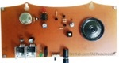
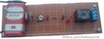

## Electronic Projects without MCU
It's an archive of electronic projects. There are simple circuits, but useful.
 
### Gallery of the Repository

<!--
### List of the Repository
[PIR Alarm](Alarm_PIR)  
[RFID Code Lock with 125KHz Tag](CodeLock_RFID)  
[Digital Clock Using Logic Gates with 7Segment Display](Clock_7SegmentDisplay)  
[Gas Leak Detector or Fire Alarm](GasDetector) 
[Gas Leak Detector or Fire Alarm Model2](GasDetector_Model2)  
[Night Light](NightLight)  
-->
