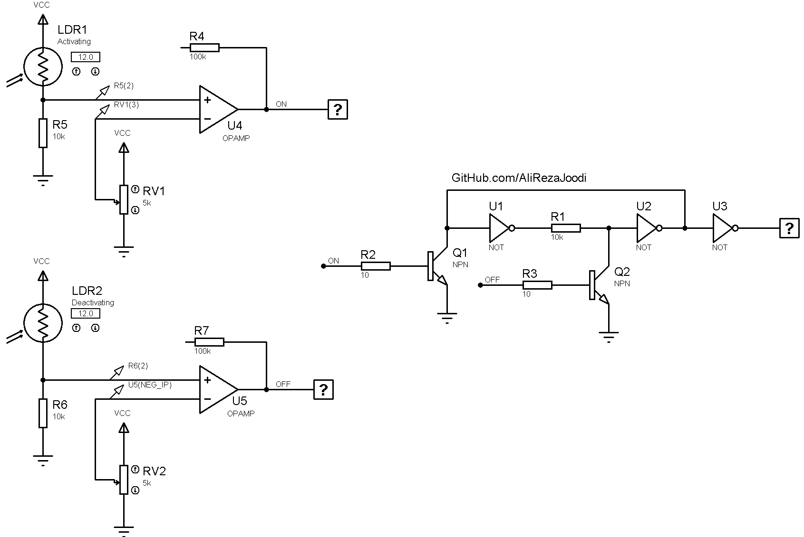

## 1CH Relay Controller with Laser Pointer
There are one relay and two LDR sensors. One of them activates the relay and the other deactivates it. 

### Folder and Files Description
It has included:
- `Pictures` (Photos Samples Made)
- `Simulate` (Simulator File)

### Simulate: v1.0

My GitHub Account: [GitHub.com/AliRezaJoodi](https://github.com/AliRezaJoodi)  
**Note**: [You can go here to download a single folder or file from GitHub.com](https://minhaskamal.github.io/DownGit/#/home)
