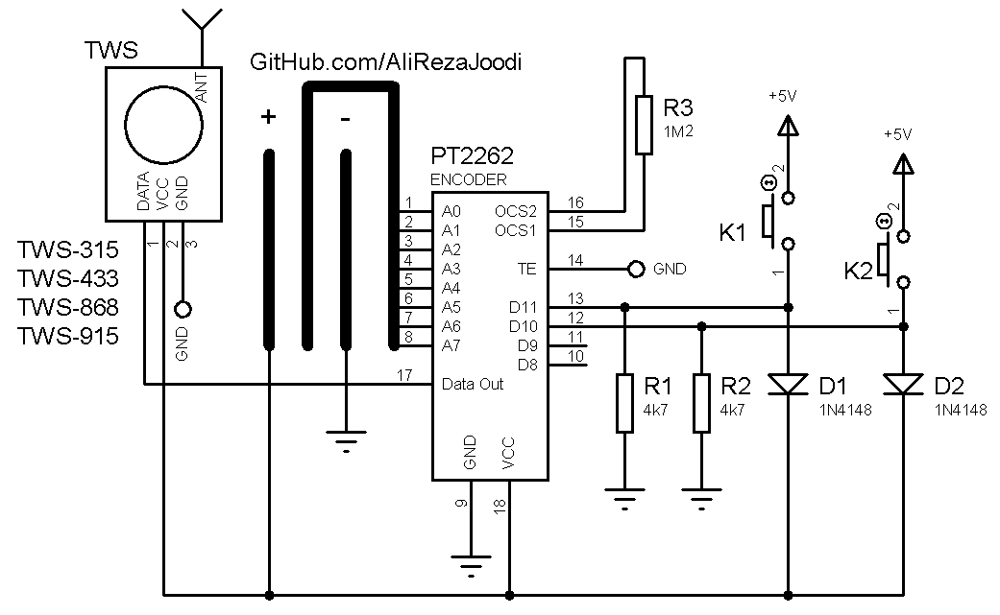
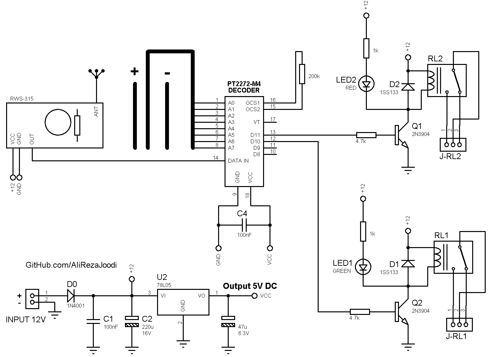

## 2CH RF Remote Controller Using ASK RF Module and PT2262 Encoder (FixCode)
I have tested it many times and worked great.

### Folders and Files Description
It has included:
- `Hardware` (Included hardware layers)
- `Pictures` (Included photos samples made)

### Schematic: Transfer(Model2) v1.0

### Schematic: Transfer v1.0

### Schematic: Receiver v1.0

### Picture: v1.x

My GitHub: [GitHub.com/AliRezaJoodi](https://github.com/AliRezaJoodi)  
**Note**: [You can go here to download a single folder or file from GitHub.com](https://minhaskamal.github.io/DownGit/#/home)