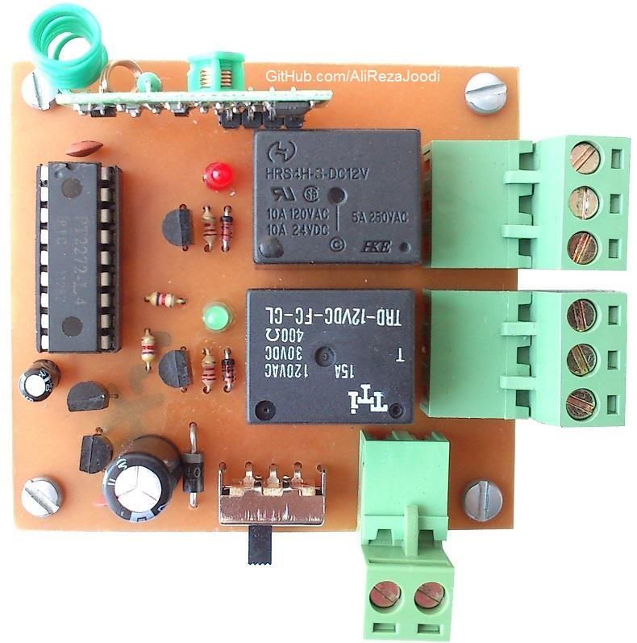
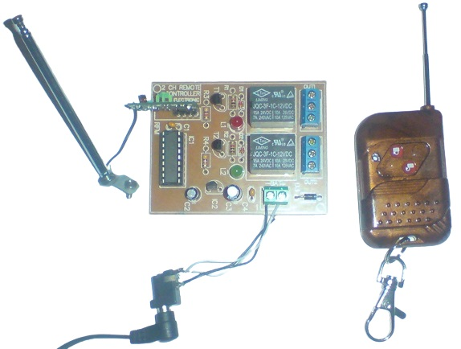
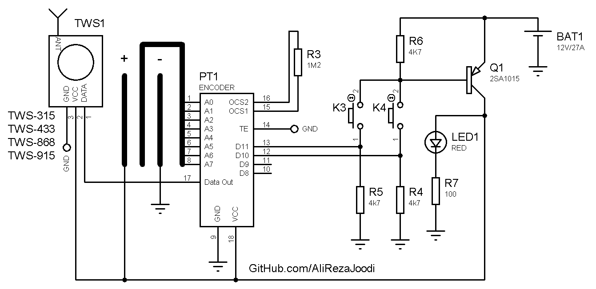
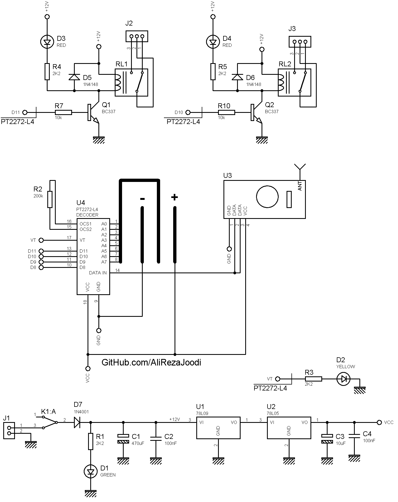
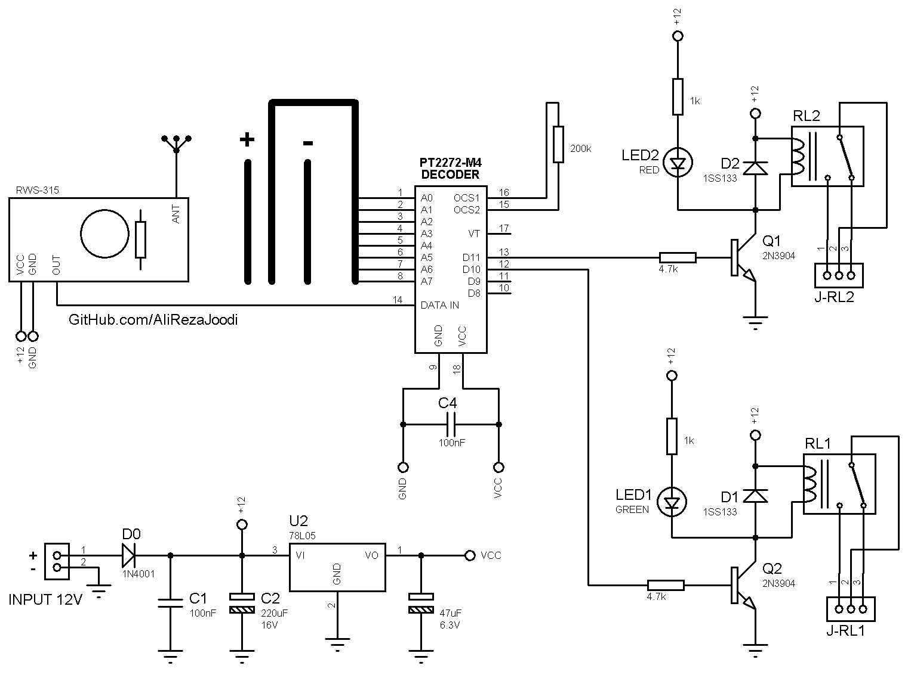

## Relay Remote Controller, RF, ASK, FixCode, 2CH
Note: This is just a prototype and needs improvement.  

### Picture
Receiver: Model2, v1.0  

Receiver: Model1, v1.0  

### Features
- **Output Type:** Relay x2
- **Relay Driver:** NPN Transistor
- **Control Method:** Remote Controlled, RF, ASK
- **Encoder:** FixCode, PT2262
- **Decoder:** PT2272
- **Power Supply:** x1

### Folders and Files
This project includes:
- `Hardware` — Schematic and PCB layout with Proteus
- `Pictures` — Project photos

### Schematic
Transfer: Model2, v1.0  

Transfer: Model1, v1.0  

Receiver: Model2, v1.0  

Receiver: Model1, v1.0  

### More Information
**Note**: [You can go here to download a single folder or file from GitHub.com](https://minhaskamal.github.io/DownGit/#/home)  
My GitHub Account: [GitHub.com/AliRezaJoodi](https://github.com/AliRezaJoodi)  