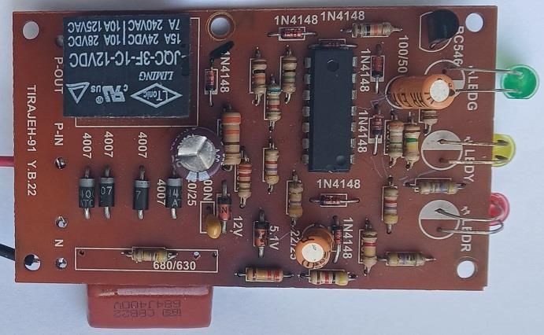
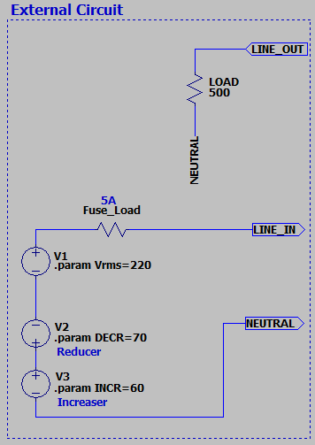
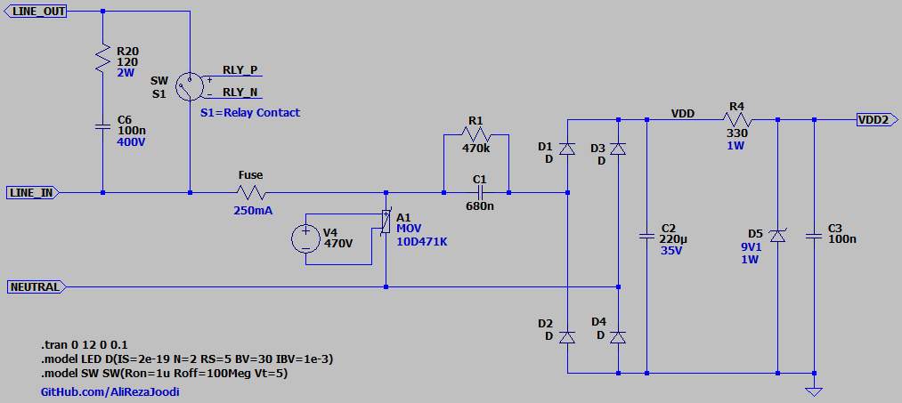
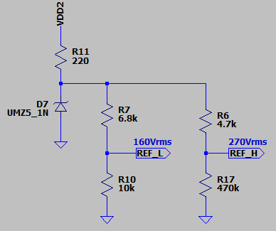
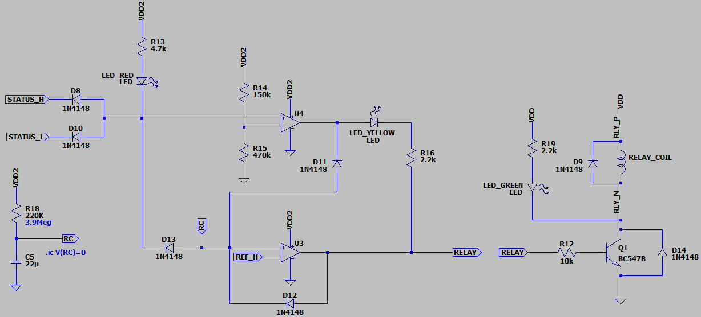
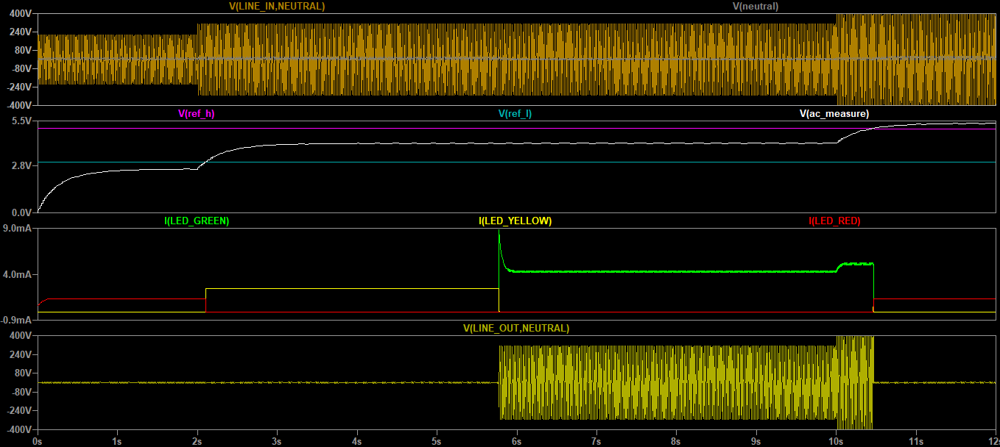

## 220V AC Voltage Protection Circuit
Note: The design is not mine. This project is just an attempt to understand and simulate a commercial product circuit using LTspice.  

### Photo
v1.0, Top  
 

v1.0, Bottom  
 

### Simulate
v1.1, Schematic  
  
  
  
  
  
  

v1.1, Plot  

Note: A short delay time was used only for simulation.  

### More Information
**Note**: [You can go here to download a single folder or file from GitHub.com](https://minhaskamal.github.io/DownGit/#/home)  
My GitHub Account: [GitHub.com/AliRezaJoodi](https://github.com/AliRezaJoodi)  